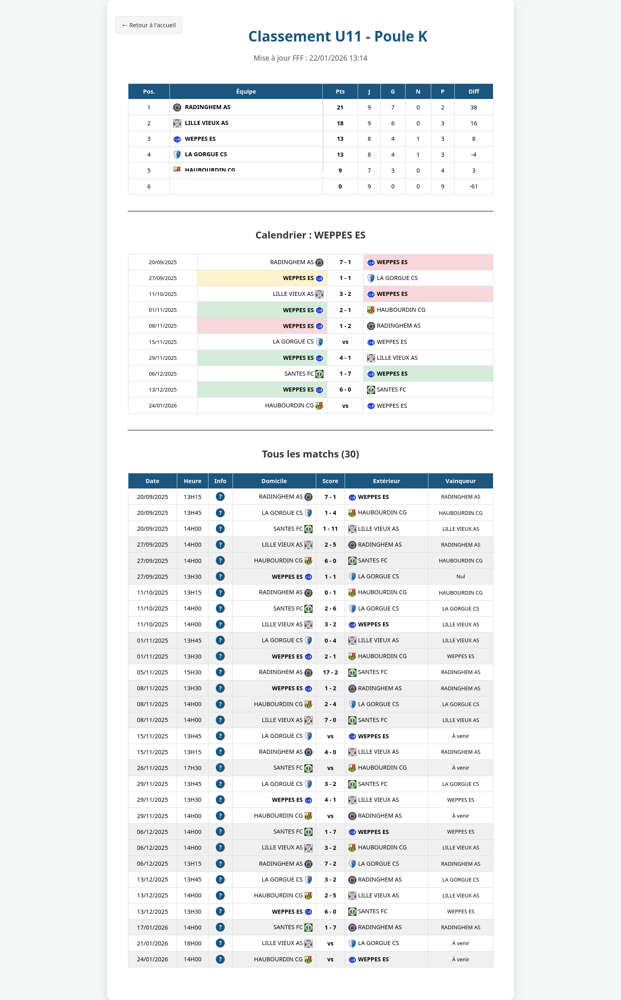

# ⚽ Open-FFF-Stats

Système dynamique permettant d'afficher les classements, calendriers et résultats des compétitions de la **FFF (Fédération Française de Football)**, particulièrement utile pour les catégories (U10 à U13) où les classements ne sont pas publiés officiellement.

Ce projet utilise l'API `api-dofa.fff.fr` pour récupérer les données en temps réel.


---

## ✨ Fonctionnalités

* 🔄 **Cache Intelligent** : Les données sont stockées localement et mises à jour seulement toutes les 4 heures pour éviter de surcharger l'API.
* 🛠️ **Gestion Multi-Phases** : Support natif des championnats à plusieurs phases (Automne / Printemps). L'interface génère automatiquement des onglets dynamiques pour naviguer entre les phases.
* 🛡️ **Gel Automatique des Archives** : Pour les saisons passées, le script coupe définitivement les appels cURL vers la FFF. Les données sont lues instantanément depuis le cache local, supprimant tout risque de blocage ou d'altération des scores historiques.
* 📱 **Responsive Design** : Affichage optimisé pour mobile avec colonnes figées (Sticky columns) pour une lecture facile des classements.
* 🎯 **Focus Équipe** : Coloration automatique (Vert/Jaune/Rouge) des résultats pour votre club.
* ⚙️ **Multi-Compétitions** : Configuration centralisée via un simple fichier JSON pour gérer plusieurs catégories (U10, U11, U12, etc.).

---

## 🚀 Installation

### Via un serveur Web (Apache/Nginx + PHP)
1. Clonez ce dépôt dans votre répertoire web.
2. Assurez-vous que votre serveur a les droits d'écriture sur le dossier pour créer les fichiers cache.
3. Vérifiez que l'extension PHP `curl` est activée (ou que `allow_url_fopen` est à On).

### Via Docker (Recommandé)
1. Renommez `docker-compose.yml.example` en `docker-compose.yml`.
2. Ajustez l'UID/GID dans le fichier pour correspondre à votre utilisateur local.
3. Lancez les conteneurs :
   ```bash
   docker compose up -d
   ```
## Configuration

1. Renommez le fichier config.json.example en config.json.
2. Pour chaque catégorie, récupérez les identifiants sur le site Epreuves FFF.
3. Exemple d'URL FFF : .../engagement/444088-u11.../phase/1/11/saison
    * ID Compétition : 444088
    * ID Phase : 1
    * ID Poule : 11

Structure du config.json
```json
{
    "saison_par_defaut": "2025_2026",
    "saisons": {
        "2025_2026": {
            "u10": {
                "titre": "Classement U10",
                "equipe_cible": "WEPPES ES",
                "phases": {
                    "1": {
                        "compet_id": "444091",
                        "poule_id": "14",
                        "date_start": "2025-09-01",
                        "date_end": "2025-12-31"
                    },
                    "2": {
                        "compet_id": "444091",
                        "poule_id": "18",
                        "date_start": "2026-01-01",
                        "date_end": "2026-08-08"
                    }
                }
            }
        },
        "2026_2027": {
            "u10": {
                "titre": "Classement U10",
                "equipe_cible": "WEPPES ES",
                "phases": {
                    "1": {
                        "compet_id": "444XXX",
                        "poule_id": "XX",
                        "date_start": "2026-09-01",
                        "date_end": "2026-12-31"
                    }
                }
            }
        }
    }
}
```
### Utilisation

* Accueil (index.php) : Portail d'accueil dynamique équipé d'un sélecteur de saison. Il génère automatiquement les boutons d'accès rapide selon la saison choisie.
* Affichage Direct (show.php) : Affiche les tableaux (Classement calculé à la volée, Calendrier focus club et détails de tous les matchs). Exemple : show.php?compet=u10&saison=2025_2026.
* Navigation par Phase : Par défaut, le script charge la phase la plus récente de la saison demandée. Pour forcer une phase spécifique, passez le paramètre dans l'URL : show.php?compet=u10&phase=1&saison=2025_2026.

### 🧠 Vibe Coding & Conception
Ce projet est fièrement développé en Vibe Coding 🏄‍♂️ !

L'architecture fonctionnelle, la stratégie de contournement du WAF et la direction produit sont pilotées par l'humain, tandis que l'implémentation technique, les optimisations algorithmiques (calculs des points, bris d'égalité), le refactoring CSS responsive et la gestion fine du cURL ont été entièrement générés et ajustés en collaboration avec une Intelligence Artificielle (Gemini).

Cette approche permet de maintenir un code moderne, hautement optimisé et développé à la vitesse de la pensée.

### Structure Technique

* index.php : Portail d'accueil dynamique lisant le JSON.
* show.php : Vue des tableaux (Classement, Calendrier équipe, Détails).
* get_data.php : Moteur de gestion de l'API et du cache.
* style.css : Thème visuel complet et responsive.